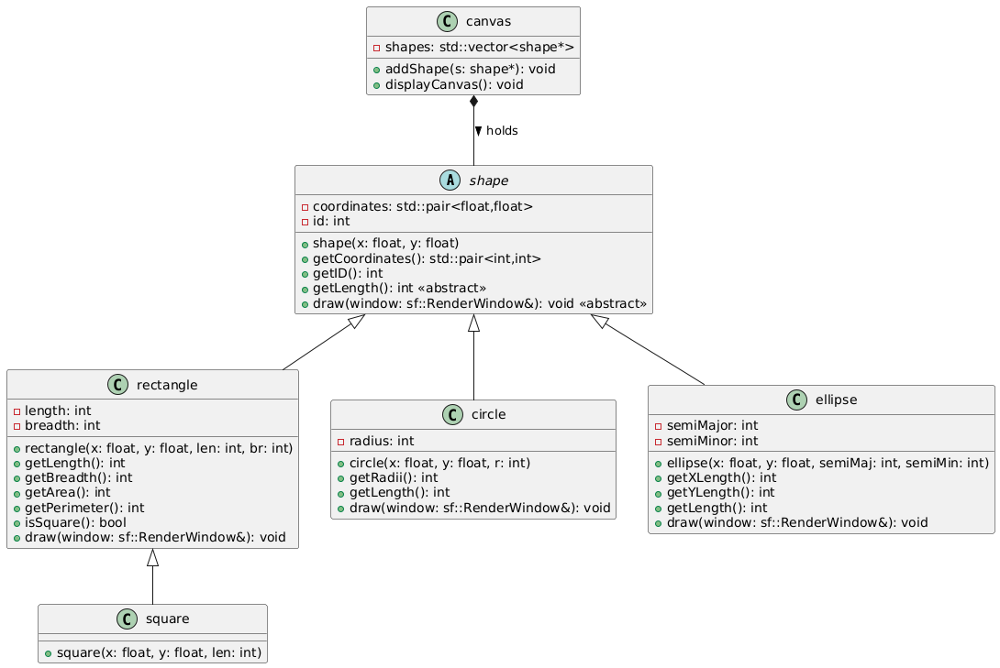

# Fundamentals of OOP

## Introduction

### Understanding Classes

- Check out chapters 14 and 15 of the [learncpp](https://www.learncpp.com)
  website. It gets very in-depth information, and you don't need to know
  everything, but looking at the example code is very useful.

- You will learn different ways to structure your code, as well as how to
  implement your way of structuring in c++. Even if you're already familiar
  with classes, it's pretty informative, so I suggest skimming through it.

### How to code projects across multiple files

- For OOP, it's a good idea to organize projects across multiple files, and have
  header files as well.

- Check out chapters 2.11, 2.12, 7.8, 7.10 for information on how to deal with
  code spanning across multiple files (the rest of chapters 2 and 7 are also
  useful, but these are the main ones)

### Compiling and running multifile projects

- Running `g++` commands each time in terminal is a possibility but is painful.
  We have `Makefiles` which will help us for this.
- They automate the compilation process, and recompiles only the ones required
  if you change them. [Here](https://makefiletutorial.com) is a nice tutorial
  for `Makefile`.

### `Makefile` for a simple C++ project

This is an example `Makefile` for a codebase which has ALL of its code in a
single directory.

```makefile
CXX = clang++
CXXFLAGS = -std=c++20 -Wall -Wextra -Werror -I<include-directories> -MMD -MP
LDFLAGS = -L<lib-directories> -l<lib-name>
SOURCES = $(wildcard *.cpp)
OBJECTS = $(SOURCES:.cpp=.o)
DEPS = $(OBJECTS:.o=.d)
TARGET = shapes

all: $(TARGET)

$(TARGET): $(OBJECTS)
	$(CXX) $^ -o $@ $(LDFLAGS)

-include $(DEPS)

clean:
	rm -rf $(TARGET) $(OBJECTS) $(DEPS)

.PHONY: all clean
```

## A simple Project

So now you have started to learn about how to start building projects in cpp. To
solidify this knowledge let us start with a basic example.

We are going to start simple with a class to represent a rectangle. So a
rectangle has 2 parameters that are used to describe it - its length and its
breadth. Encode this into the class used to make the rectangle object.

### A basic `Rectangle` class

- Make a basic class to represent a rectangle.
- Include methods `get_length()`, `get_breadth()` as part of this class.
- Feel free to add other parameters/methods such as color, `get_area()`, etc. Be
  creative and add as many relevant features as you can.

Now that we have a rectangle object, the natural next step is a square.

### The `Square` Subclass

- Make a subclass of the `Rectangle` to create a `Square` class.
- Include checks wherever appropriate to make sure that the sides of the square
  are equal.
- Add a function `is_square()` to your original class.

This is looking good but let's make more life complicated. We want to add a
circle. The issue is: how to link the circle class to the other two shape
classes? Well, making all of them have a parent shape class seems fair enough.

### The `Shape` Parent class

- Make a `Circle` class and enclose all the created classes in a parent class
  called `Shape`. Things may break unless you create Shape class appropriately,
  refer [polymorphism](https://www.learncpp.com/cpp-tutorial/virtual-functions)
  to get a better grasp on the issue.
- An example:

```c++
Shape *A;
A = new Rectangle();
A->get_length();
```

### Shapes++

- The framework is set up now. Build as you wish!

### `get_shape()`

- The shape class must have implemented a function `get_shape()` that returns an
  integral value to denote the shape it actually represents

```c++
Shape *A;
A = new Rectangle();
std::cout << A->get_shape();
```

The above should output `0` to denote that the shape is a rectangle, the mapping
between shapes and their id's is given in the end of the document. Feel free to
use consecutive id's continuing from there for your custom shapes.

### Coordinates

- Add a coordinate system to allow shapes to be translated in the 2D plane.
- The default for any shape must be (0,0).

In general, please use the DRY principle (Don't repeat yourself), if you are
ever copy-pasting code, you are robbing away modularity. This example, while
possible to implement by rewriting code for each shape class, is designed to
allow you to learn about modular code, and writing code that makes future
extension easier.

### Shape Interface & Derived Classes

Each shape is assumed to be **axis-aligned** (i.e., no rotation).

#### Base Class: `Shape`

- `get_shape()` — returns the **shape ID** (see mapping below)

#### `Rectangle`

- `get_length()` — returns the **length** (x-dimension)
- `get_breadth()` — returns the **breadth** (y-dimension)

#### `Square`

- `get_length()` — returns the **side length** (same as length and breadth)
- `get_breadth()` — optional or same as length for compatibility

#### `Circle`

- `get_radii()` — returns the **radius**

#### `Ellipse`

- `get_x_length()` — returns the **semi-major axis** (x-direction)
- `get_y_length()` — returns the **semi-minor axis** (y-direction)

### Shape ID Mapping (via `get_shape()`)

| Shape     | ID |
|-----------|----|
| Rectangle | 0  |
| Square    | 1  |
| Circle    | 2  |
| Ellipse   | 3  |

## UML and External Libraries

Till now, we implemented the shape classes to understand the concepts we learned
better. However, you may have found it difficult to design and keep in mind all
the relationships and functions that you are adding under each class.

This is because we skipped the important step of actually designing our classes,
methods, relationships between them and directly jumped to their implementation.
Even if you could manage that in the exercise without an explicit design phase,
as we build more complicated structures, this makes things much harder.

**UML** (Unified Modeling Language) diagrams help us immensely to design our
class structures in **such a manner** that the only thing left is to fill in the
logic of the methods, which is also quite simple due to most major problems
being fixed priorly.

### Understanding UML

- You can refer the UML's [website](https://www.uml.org) to learn more on it.
- A lot of resources are in the internet and YouTube, teaching UML.

> Ideally, a project would start with the designing of the classes, but we have
> switched the order here for ease of understanding.

### Making UML diagram for Shapes designed last week

- Use the tool you like to make the UML diagrams for the `Shape` and related
  classes.
- If you created additional classes (say for coordinates), make sure to add them
  too.

### Canvas Class - External Libraries (SFML)

- Implement a `Canvas` class that can hold a `vector<Shape*>` to denote all the
  shapes held by the canvas. Before doing so, make sure to create the UML
  diagram of the same and add it to the overall design.
- Create an `addShape()` method that takes a shape pointer and adds it to the
  canvas.
- Using the SFML library, implement a function `displayCanvas()` capable of
  creating a persistent window and printing all the shapes you have created (at
  least ellipse, rectangle, circle, square). Note that are expected to
  distribute the display logic of each shape to its own class.
- While it is possible to handle this in the canvas class, this is against the
  learning goal, and is not helpful.

The resources and the documentation for SFML are available in the SFML's
official [website](https://www.sfml-dev.org)

See the UML diagram below:


